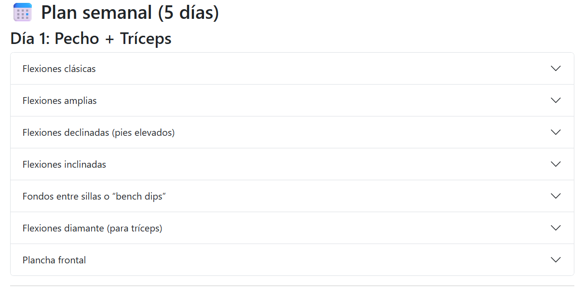

# Training Schedule 🏋️‍♂️

Un calendario de entrenamientos orientado a fortalecer la musculatura y mejorar la postura de manera progresiva.  
Este proyecto está desarrollado en **HTML y CSS**, pensado como una aplicación sencilla y visual para organizar rutinas semanales.

---

## 📸 Vista previa
  
*(Reemplaza esta imagen con una captura real de tu proyecto)*

---

## 🚀 Características

- Calendario semanal con entrenamientos estructurados.
- Enfoque en **ejercicios de fuerza y postura**.
- Interfaz limpia y ligera (solo HTML y CSS).
- Fácil de usar y extender.

---

## 📂 Estructura del proyecto

- bootstrap -> recursos gráficos y funcionales de maquetación
- images -> imágenes ilustrativas
- index.html -> entrada al sitio
- README.md -> descripción del proyecto

---

## ⚙️ Instalación y uso

1. Clona este repositorio:
   ```bash
   git clone https://github.com/saulkrujoski/training-schedule.git

2. Ingresa a la carpeta del proyecto:

    ```bash
    cd training-schedule

3. Abre index.html en tu navegador favorito.

## 📱 Responsividad

El diseño está adaptado para pantallas de escritorio.
(Mejora pendiente: adaptar a móviles y tablets con media queries.)

## 🛠️ Tecnologías usadas

- HTML5
- CSS3
- (opcional) JavaScript en versiones futuras

## 📌 Roadmap

- Optimizar diseño para móviles.
- Agregar sistema de colores personalizables.
- Permitir guardar entrenamientos personalizados.
- Mejorar accesibilidad (contraste, etiquetas alt).

## 🤝 Contribuciones

¡Contribuciones son bienvenidas!
Si quieres mejorar el calendario:

1. Haz un fork del proyecto.
2. Crea una rama para tu feature (git checkout -b feature/nueva-funcionalidad).
3. Realiza un commit de tus cambios (git commit -m 'Agregada nueva funcionalidad').
4. Haz un push (git push origin feature/nueva-funcionalidad).
5. Abre un Pull Request.

## 📄 Licencia

Este proyecto está bajo la licencia [MIT](./LICENSE).  
También puedes leer la [traducción al español](./LICENSE_es.md).